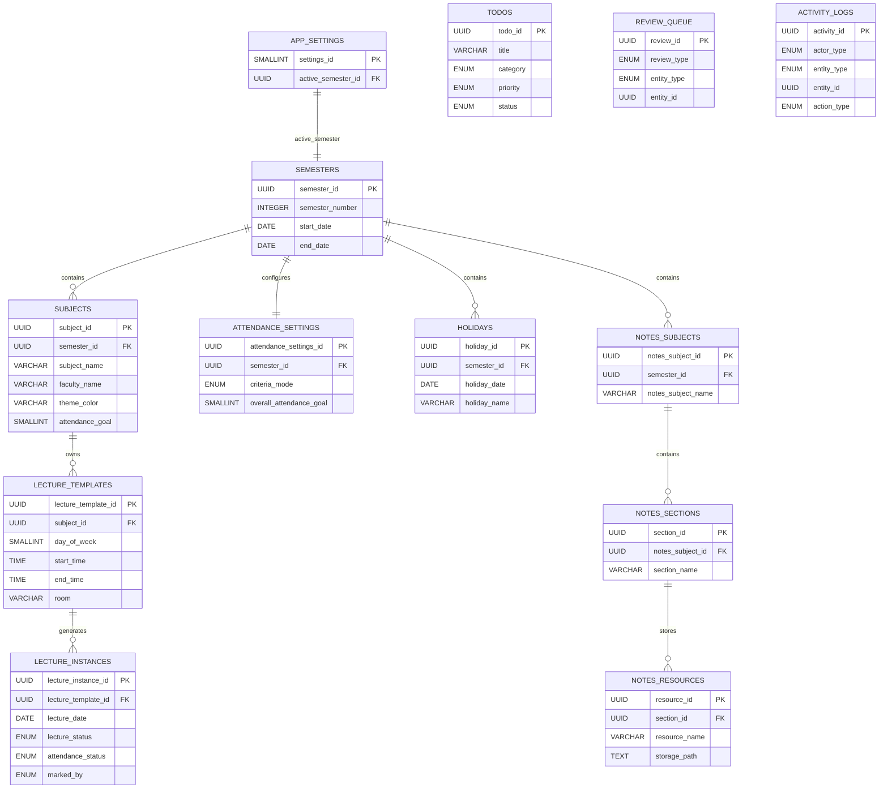

# Student Buddy Entity Relationship Diagram
Version: 1.0 (Pre-Finance Module)

---

# 1. Introduction

This document defines the relationships between all database entities used by Student Buddy.

Unlike the Database Schema document, which describes each table individually, this document focuses on how the tables are connected.

The Finance module is intentionally excluded from this version.

---

# 2. Relationship Overview

The database is divided into five logical modules.

- Global Module
- Academic Module
- To-Do Module
- Notes Repository Module
- AI Module

The Academic Module acts as the core of the database.

---

# 3. Cardinality Summary

| Parent Table | Child Table | Relationship |
|--------------|------------|--------------|
| semesters | subjects | One-to-Many |
| semesters | attendance_settings | One-to-One |
| semesters | holidays | One-to-Many |
| semesters | notes_subjects | One-to-Many |
| subjects | lecture_templates | One-to-Many |
| lecture_templates | lecture_instances | One-to-Many |
| notes_subjects | notes_sections | One-to-Many |
| notes_sections | notes_resources | One-to-Many |

---

# 4. Entity Relationship Diagram

**Note**

The relationship between `app_settings` and `semesters` is a reference rather than an ownership relationship.

`app_settings.active_semester_id` stores the currently active semester.

---

# 5. Polymorphic Relationships

Two tables intentionally do not use foreign key constraints.

---

## Review Queue

Review Queue stores references to existing entities.

Relationship is determined using:

- entity_type
- entity_id

Possible referenced entities:

- lecture_instances
- todos
- finance (future)

This polymorphic association is enforced through application logic.

---

## Activity Logs

Activity Logs also use a polymorphic association.

Relationship is determined using:

- entity_type
- entity_id

Possible referenced entity types include:

- semesters
- subjects
- lecture_instances
- holidays
- todos
- notes_resources
- review_queue
- settings
- finance (future)

This allows one history table to support every module.

---

# 6. Special Relationships

## Academic Subject → Notes Subject

Whenever an Academic Subject is created,

the application automatically creates a Notes Subject with the same name.

This relationship is managed entirely by application logic.

No foreign key exists between these tables.

---

## Lecture Templates → Lecture Instances

Lecture Templates define recurring weekly lectures.

Lecture Instances are generated from these templates for the entire semester.

Attendance is stored only in Lecture Instances.

---

## Attendance Settings

Each Semester owns exactly one Attendance Settings record.

This determines whether attendance is calculated using:

- Overall Mode
- Subject Mode
- Custom Mode

---

# 7. Design Decisions

The following design principles were followed while creating the ER model.

- Normalized database structure
- Offline-first architecture
- Separation of timetable and attendance
- No duplicate storage of calculated values
- Activity Logs are append-only
- Review Queue stores references instead of application data
- Notes Repository is independent from Academic Subjects
- Finance Module intentionally excluded

---

# 8. Summary

The ER model consists of:

- 13 database tables
- 8 foreign key relationships
- 2 polymorphic relationships
- 1 automatic application-managed relationship

This structure provides a modular, scalable and maintainable foundation for the Student Buddy application.

# Relationship Legend

| Symbol | Meaning |
|---------|---------|
| 1 : 1 | One-to-One |
| 1 : N | One-to-Many |
| FK | Foreign Key |
| PK | Primary Key |
| Application Managed | Relationship maintained through application logic |
| Polymorphic Association | Relationship determined by entity_type + entity_id |